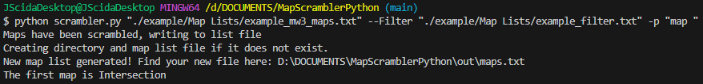

# MapScramblerPython

This was written with the [Plutonium](https://plutonium.pw/) project in mind.

- [MapScramblerPython](#mapscramblerpython)
  - [Example](#example)
  - [Requirements](#requirements)
  - [Arguments](#arguments)

This is a small tool to randomize the map list found in the server settings
file. This was very annoying for me to do by hand as it could take upwards of
10 minutes each time. Plutonium does not support automatic map list scrambling
so I made it myself.

Before using, please ensure that you have a map list that is in the proper
format. There are properly formatted lists in this repository that you can use
as templates.

## Example



`python scrambler.py "./example/Map Lists/example_mw3_maps.txt" --Filter "./example/Map Lists/example_filter.txt" -p "map "`

## Requirements

- Python 3.9 or greater

## Arguments

| Argument | Required | Description | Example |
| - | - | - | - |
| `MapFile` | :heavy_check_mark: | Path to the map file. Can be relative. Goes right after script file name. | ```python scrambler.py /c/gameserver/maps.txt -l -p "mp "```, ```python scrambler.py "C:\gameserver\maps.txt" -l -p "map "``` |
| `--ServerFile`   | :x: | Path to server.cfg file. Can be relative. | `--ServerFile /c/gameserver/server.cfg`, `--ServerFile "C:\gameserver\server.cfg"` |
| `--PreArg`       | :x: | Arguments that go before the map list. Note that spaces or new lines at the end will not be added by the script, so they must be present in the string given.                                                                                            | ```--PreArg "set sv_hostname \"Game Server\" set g_gametype \"war\" set sv_maprotation "```|
| `--PostArg` | :x: | Arguments that go after the map list. Note that spaces or new lines at the beginning will not be added by the script, so they must be present in the string given.| See `--PreArg` example.|
| `--ArgSliceChar` | :x: | An alternative to `--PreArg` and `--PostArg`, place a character in your server.cfg file directly before and after the map list. This **CANNOT** be used with `--PreArg` **OR** `--PostArg`| `--ArgSliceChar "$"`|
| `--OutputDir` | :x:| Path to the desired output directory. ||
| `--OutputFile` | :x: | Path to desired output file if different from default: `./out/maps.txt`||
| `--Filter` | :x: | A comma separated list or a path to a file containing maps to be filtered out of the scrambler. Example provided in `example/`||
| `-o`, `--override`   | :x: | Overrides the original server.cfg with the new one. Only use this if you know what you are doing. ||
| `-p`, `--prefix` | :x: | Prefix for map names if the game requires it(e.g. mp [map name]). Spaces will not be added to the end of this string.| `-p "mp "`|
| `-q`, `--quotes` | :x: | Encapsulates the map list in quotes.||
